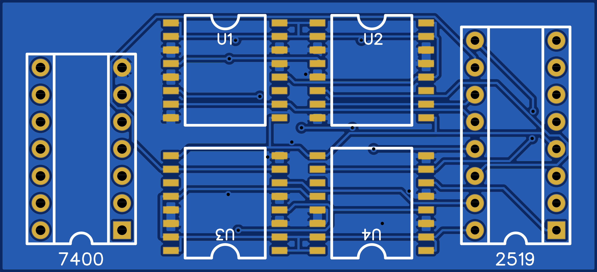
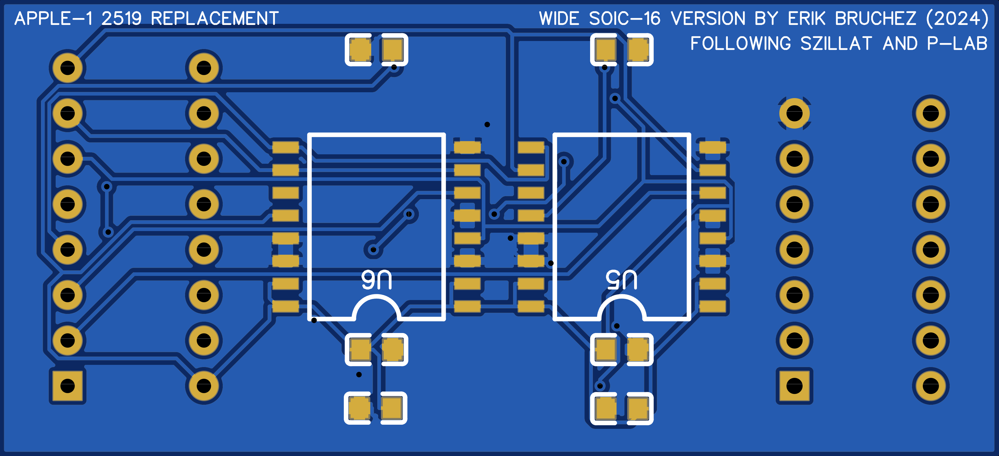
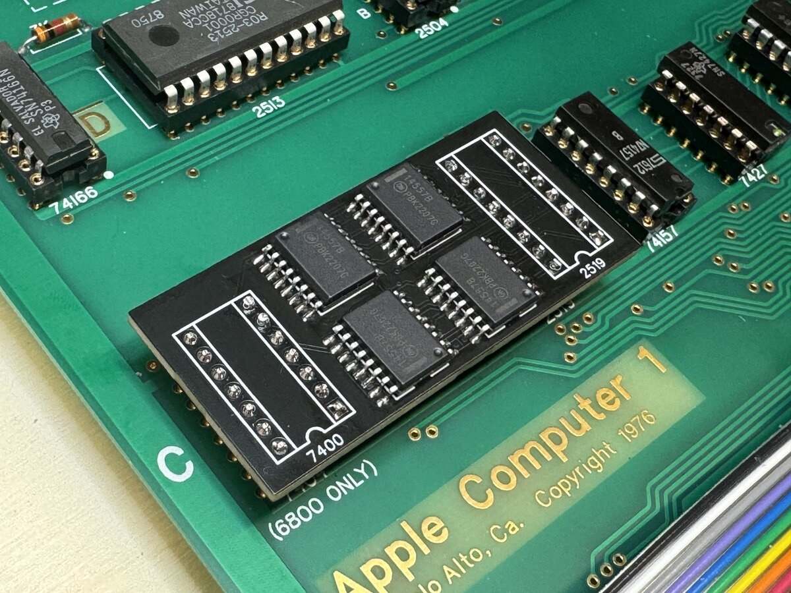

## What it is

This is a replacement board for the Signetics 2519 chip used in the Apple-1 computer.

It is based on the work of Szillat and P-LAB, so I stand on the shoulders of giants:

- Szillat's 2519 replacement
    - [Through-hole](https://oshwlab.com/szillat/2519-fixed)
    - [SMD](https://oshwlab.com/szillat/2519-fixed-smd)
- [P-LAB's 2519 replacement SMD](https://p-l4b.github.io/2519/)

## Why is this useful?

As of 2024, the 2519 has only a single source (and I think that this has been the case for a very long time). With shipping, that single chip would cost over USD 85.

This board is a drop-in replacement for the original chip, and uses more modern and available 14557 shift registers. However, note that it is designed specifically to fit on the Apple-1 board, by straddling two chip sockets:

- the 2519 16-pin DIP
- the 7400 14-pin DIP to its left
    - this is unused on an Apple-1 with the 6502 CPU
    - however, it is used on this board to provide stability and ground

## What's special about this specific board?

The small-package SOIC-16 14557 chips used by the existing boards are not available from major electronics components stores (or only in very large quantities). When I built [P-LAB's SMD version](https://p-l4b.github.io/2519/), I had to buy the chips on eBay, and they are not reliably available there either. However, the Wide SOIC-16 chips are easily available. So this board is a simple redesign to support the wider chips. I managed to do this without making the board larger, partly by putting all the decoupling capacitors on the bottom side.

## Versions

- [V1.0](v1.0): Initial version. I assembled one such board and it's been working fine.
- [V1.1](v1.1): Version with fatter +5V traces, additional via for decoupling capacitors.
    - I HAVEN'T TESTED THIS VERSION YET.
    - 2025-01-02: I got a report from someone who tested this successfully :)

## BOM

| Quantity | Item                   | DigiKey Link                                                                                                 | Mouser Link                                                                              |
|----------|------------------------|--------------------------------------------------------------------------------------------------------------|------------------------------------------------------------------------------------------|
| 1        | 2519 Replacement PCB   | N/A                                                                                                          | N/A                                                                                      |
| 6        | 14557 Shift Register   | [DigiKey - MC14557BDWR2G](https://www.digikey.com/en/products/detail/onsemi/MC14557BDWR2G/10267937)          | [Mouser - 863-MC14557BDWR2G](https://www.mouser.com/ProductDetail/863-MC14557BDWR2G)     |
| 6        | 0.1uF Capacitor (0603) | [DigiKey - C0603C104K3RAC7082](https://www.digikey.com/en/products/detail/kemet/c0603c104k3rac7082/12700954) | [Mouser - 80-C0603C104K3R7082](https://www.mouser.com/ProductDetail/80-C0603C104K3R7082) |
| 1        | 16-Pin Header          | [DigiKey - 220-1-16-003](https://www.digikey.com/en/products/detail/cnc-tech/220-1-16-003/3441516)           | N/A                                                                                      |
| 1        | 14-Pin Header          | [DigiKey - 220-1-14-003](https://www.digikey.com/en/products/detail/cnc-tech/220-1-14-003/3441515)           | N/A                                                                                      |

## WARRANTY AND DISCLAIMER

__This information is provided as-is, with no warranty. I have tested it on an Apple-1 reproduction, and it works for me. However, I cannot guarantee that it will work for you. I am not responsible for any damage to your Apple-1 (reproduction or original) or other equipment that may result from using this board. I am especially not responsible if you try this on an original Apple-1 and it doesn't work or, worse, destroys your priceless computer. Use at your own risk.__
